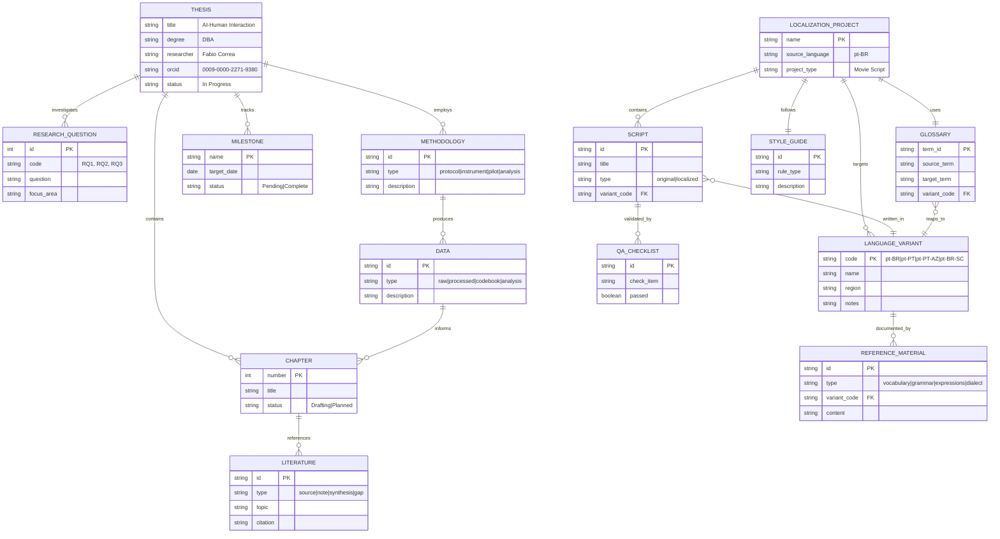

# Entity Relationship Diagram

> Mermaid ER diagram representing the workspace structure

## Entity Descriptions

### PhD Thesis Project

| Entity | Description |
|--------|-------------|
| `THESIS` | Main doctoral research on AI-Human Interaction |
| `RESEARCH_QUESTION` | Three RQs about AI reliance, trust, and transparency |
| `CHAPTER` | Seven thesis chapters with progress tracking |
| `LITERATURE` | Academic sources, notes, synthesis, and gap analysis |
| `METHODOLOGY` | Research protocols, instruments, pilots, analysis methods |
| `DATA` | Raw data, processed outputs, codebooks, analysis results |
| `MILESTONE` | Key deadlines and deliverables |

### Localization Project

| Entity | Description |
|--------|-------------|
| `LOCALIZATION_PROJECT` | Movie script adaptation across Portuguese variants |
| `LANGUAGE_VARIANT` | pt-BR, pt-PT, pt-PT-AZ (Azores), pt-BR-SC (Manezinho) |
| `SCRIPT` | Original and localized screenplay versions |
| `GLOSSARY` | Term mappings between language variants |
| `STYLE_GUIDE` | Localization standards and conventions |
| `REFERENCE_MATERIAL` | Vocabulary, grammar, expressions, dialect guides |
| `QA_CHECKLIST` | Quality assurance validation items |
