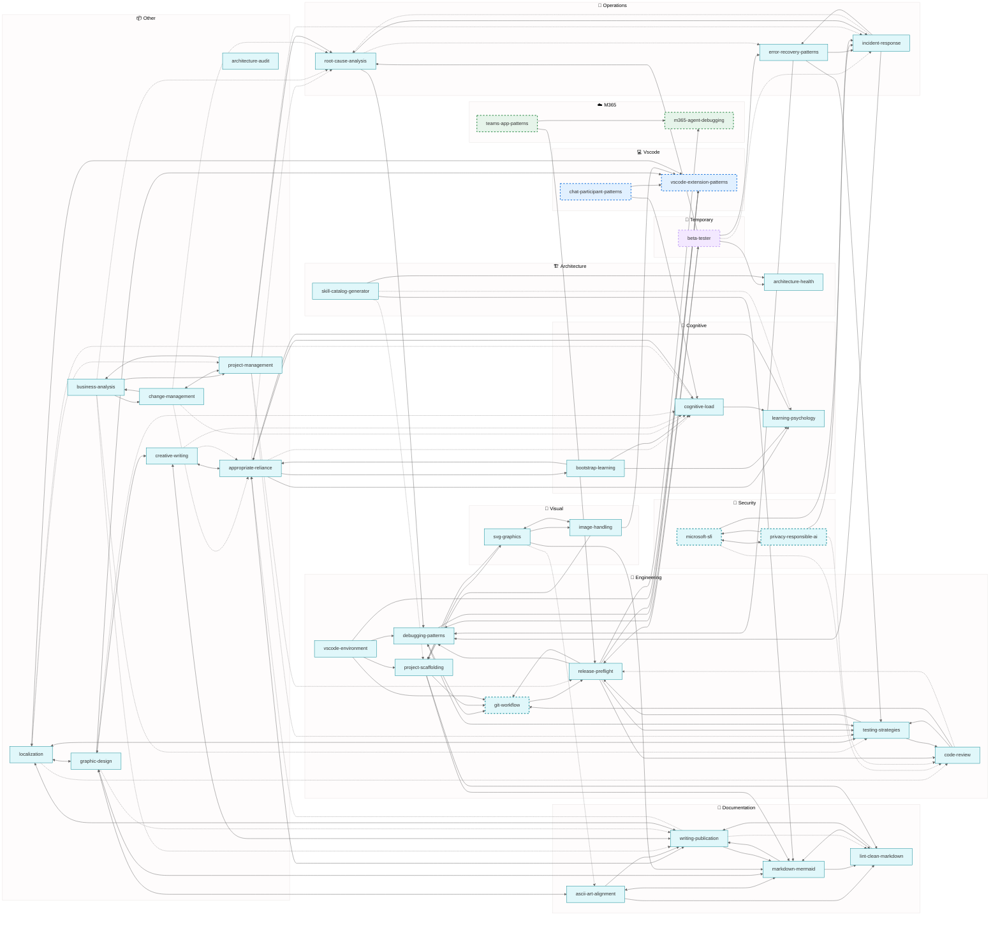

# Alex Skills Catalog (Generated)

> Generated: 2026-01-31
> Total Skills: **38** (33 inheritable, 0 master-only, 2 VS Code, 2 M365, 1 temporary)
> Total Connections: **149** (19 bidirectional, 49 weak)

---

## Network Diagram

---

## Legend

| Color | Inheritance |
| ----- | ----------- |
| 🟨 Yellow | Master-only |
| 🟦 Blue | VS Code heir |
| 🟩 Green | M365 heir |
| 🟪 Purple (dashed) | Temporary |
| 🧊 Cyan | Inheritable |

| Arrow | Meaning |
| ----- | ------- |
| `<-->` | Bidirectional (mutual) |
| `-->` | Strong connection (≥0.7) |
| `-.->` | Weak connection (<0.7) |

---

## Skills by Inheritance

### 🧊 Inheritable (33)

| Skill | Connections |
| ----- | ----------- |
| academic-research | 6 |
| appropriate-reliance | 4 |
| architecture-audit | 7 |
| architecture-health | 3 |
| ascii-art-alignment | 3 |
| bootstrap-learning | 4 |
| business-analysis | 6 |
| change-management | 7 |
| code-review | 3 |
| cognitive-load | 3 |
| creative-writing | 6 |
| debugging-patterns | 2 |
| error-recovery-patterns | 3 |
| git-workflow | 2 |
| graphic-design | 7 |
| image-handling | 3 |
| incident-response | 3 |
| learning-psychology | 3 |
| lint-clean-markdown | 3 |
| localization | 8 |
| markdown-mermaid | 2 |
| microsoft-sfi | 4 |
| privacy-responsible-ai | 3 |
| project-management | 7 |
| project-scaffolding | 4 |
| refactoring-patterns | 3 |
| release-preflight | 5 |
| root-cause-analysis | 3 |
| skill-catalog-generator | 5 |
| svg-graphics | 4 |
| testing-strategies | 3 |
| vscode-environment | 4 |
| writing-publication | 3 |

### 🟨 Master-Only (0)

| Skill | Connections |
| ----- | ----------- |

### 🟦 VS Code Heir (2)

| Skill | Connections |
| ----- | ----------- |
| chat-participant-patterns | 3 |
| vscode-extension-patterns | 2 |

### 🟩 M365 Heir (2)

| Skill | Connections |
| ----- | ----------- |
| m365-agent-debugging | 1 |
| teams-app-patterns | 2 |

### 🟪 Temporary (1)

| Skill | Connections | Remove After |
| ----- | ----------- | ------------ |
| beta-tester | 5 | stable-release |

---

## Staleness-Prone Skills

| Skill | Reason |
| ----- | ------ |
| vscode-extension-patterns | Platform/API changes frequently |
| chat-participant-patterns | Platform/API changes frequently |
| m365-agent-debugging | Platform/API changes frequently |
| teams-app-patterns | Platform/API changes frequently |
| llm-model-selection | Platform/API changes frequently |
| git-workflow | Platform/API changes frequently |
| privacy-responsible-ai | Platform/API changes frequently |
| microsoft-sfi | Platform/API changes frequently |

---

*Generated by Alex: Generate Skill Catalog command*
